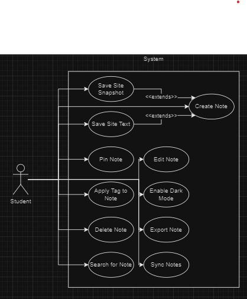

# Requirements:

## **1\. Positioning:**

***1.1 Problem statement***  
	The failure to manage digital notes affects students using Canvas, leading to lost information and inefficiencies. This results in wasted time and decreased productivity.  

***1.2 Product Position Statement***  
For students who need an efficient way to manage notes, WebNotes is a chrome extension that allows users to create, organize, and save notes directly from their browser. Unlike traditional sticky notes or basic note-taking apps, our product offers seamless integration with web pages, enabling quick access and context  

***1.3 Value proposition and customer segment***

  **Value Proposition:** WebNotes is a note taking and organization software that allows students who use Canvas to capture and manage information efficiently, boosting their academic performance.
  **Consumer Segment:** College Students who use Canvas and take digital notes.

## **2\. Stakeholders:**

* **Users:** Students who use Canvas; NAU students  
  * Students who use Canvas are our target users. They will be the ones using our product daily and will be leaving feedback.  
* **Competitors:** Post It All: Sticky notes; Web Sticky Notes; Sticky Notes Plus  
  * These are our competitors. They are who we are trying to beat when it comes to features and ease of use.  
* **Detractors:** Students who take notes exclusively with paper  
  * These students are our detractors. They would not be users of WebNotes and may discourage others from trying.  
* **Developers:** WebNotes development team  
  * The team behind it all. We develop and upkeep the software to ensure any potential bugs are fixed timely.

## **3\. Functional requirements (features):**

*1\) **Create and manage notes:** Users can create, edit, and delete notes directly from the Chrome extension.  
*2\) **Highlight and save web text:** Users can highlight text on any webpage and save it as a note within the extension.  
*3\) **Organize notes with tags:** Users can organize notes by adding tags for easy searching and categorization.  
*4\) **Search notes:** A search functionality that allows users to find saved notes based on keywords or tags.  
*5\) **Export notes:** Users can export notes in different formats (e.g., plain text, PDF).  
*6\) **Sync across devices:** Users can sync notes across multiple devices by signing in with their account.  
*7\) **Auto-save:** Notes are automatically saved as users type.  
*8\) **Pin notes:** Users can pin important notes to keep them easily accessible.  
*9\) **Webpage snapshot:** Users can save a snapshot or URL of the webpage with the note for context.  
*10\) **Dark mode:** A user interface option for dark mode to enhance readability in low-light conditions.

## **4\. Non-functional requirements:**

*1\) **Usability:** The interface should be intuitive and user-friendly, allowing users to save notes in under 5 seconds. Usability tests will ensure a success rate of 90% or higher.  
*2\) **Performance:** The extension should load and save notes within 1 second after user input on an average internet connection.  
*3\) **Security:** Notes and user data should be encrypted both in transit and at rest. All saved data must be compliant with privacy standards like GDPR.  
*4\) **Compatibility:** The extension must work on the latest versions of Chrome and other commonly used browsers.  
*5\) **Availability:** The service should be available 99.9% of the time, excluding scheduled maintenance.  
*6\) **Portability:** Users should be able to sync their notes across different devices without any data loss or performance degradation.  
*7\) **Scalability:** The extension must handle up to 100,000 users without performance loss, with the ability to scale further.  
*8\) **Accessibility:** The extension should be WCAG 2.1 compliant, ensuring it is accessible to users with disabilities, including keyboard navigation support and screen reader compatibility.

## **5\. MVP:**

Our minimal viable product will be a working chrome extension that is able to be installed and used on any given canvas webpage. The extension will have a popup window that when clicked on allows users to create a new note. This will look like a blank sticky note that is draggable and is able to edit its text. The chrome extension will send an http request to our Python server of the created note which will then be stored in our database. The notes will be organized in the database by the URL they were created on. The server will send responses back to the chrome extension of any previously created notes for the current page from the database. Each sticky note will also have a “delete” button that allows the user to remove any created notes.

To validate our MVP, we will first allow users who have never used our prototypes to create a new note without any help. By observing and recording the users struggles and successes when using the MVP, we can create a plan for improving the product. We are primarily looking for successfully created notes that are sent and stored to our database that are correctly recreated as the web page is reloaded.

## **6\. Use cases:**  
***6.1 Use case diagram***  
**

***6.2 Use case descriptions and interface sketch***

### *Use Case 1: Create Note*

* *Actor: Student*  
* *Trigger: The student decides to create a new note*  
* *Pre-conditions: The student has the extension installed*  
* *Post-condition: The student creates a new note*  
* *Success Scenario:*  
  *1\) The student opens the extension.*
  *2\) The student selects the “Add a new note” option.*  
  *3\) The student writes the note.*  
  *4\) The student saves the new note.*  
  *5\) The system saves the note, user, and url information to the database.*  
  *6\) The new note is displayed on the site.*

**

### *Use Case 2: Edit Note*

* *Actor: Student*  
* *Trigger: The student decides to edit a note they have made*  
* *Pre-conditions: The note must belong to the student*  
* *Post-condition: The note is changed*  
* *Success Scenario:*

  *1\) The student selects the note they wish to edit*

  *2\) The student enters editing mode by selecting the pencil icon on the note*

  *3\) The student makes changes to the note*

  *4\) The student saves the changes*

  *5\) The system saves the updated note to the database*

  *6\) The system displays the updated note on the site*

**
### *Use Case 3: Pin Note*

* *Actor: Student*  
* *Trigger: The student sees a note they want to pin*  
* *Pre-conditions: A note exists on the page*  
* *Post-condition: The note appears in their pinned notes list*  
* *Success Scenario:*

  *1\) The student selects the note they wish to pin*

  *2\) The student selects the pin icon on the note*

  *3\) The system saves the note to the student's list of pinned notes*

**
### *Use Case 4: Delete Note*

* *Actor: Student*  
* *Trigger: The student has a note they wish to delete*  
* *Pre-conditions: The student has at least one note.*  
* *Post-condition: The note is deleted from the database and the page*  
* *Success Scenario:*

  *1\) The student selects the note they wish to delete*

  *2\) The student selects the trash can icon on the note*

  *3\) The system displays a confirmation message.*

  *4\) The student selects the “Yes” option*

  *5\) The system removes the note from the database*

* *Alternate Scenario:*

	*4b) The student selects the “No option”*  
	*5\) The system ends the deletion process.*  
    
** 
### *Use Case 5: Export Note*

* *Actor: Student*  
* *Trigger: The student sees a note they wish to save to a file*  
* *Pre-conditions: There is at least one note on the page*  
* *Post-condition: A copy of the note will be saved as a .txt file in the Downloads folder*  
* *Success Scenario:*

  *1\) The student selects the note they wish to export*

  *2\) The student selects the file icon on the note*

  *3\) The system will prompt a download of a .txt file with the same text*

**

## **7\. User stories:**

#### Ordered priority:

1. As a student, I want to create a new note quickly, so that I can easily store important information. **Estimation:** 5 hours
2. As a student, I want to edit my existing notes, so that I can keep my notes up to date. **Estimation:** 1 hours
3. As a student, I want to categorize my notes with tags, so that I can easily group relevant notes. **Estimation:** 3 hours 
4. As a user, I want to search my notes based on tags, so that I can quickly locate specific information. **Estimation:** 13 hours  
5. As a user, I want my notes to sync across my devices, so that I can access my notes wherever I am. **Estimation:** 8 hours
6. As a user, I want my notes to be secure, so that only people I authorize can see them. **Estimation:** 13 hours
7. As a user, I want to highlight and save important information, so that I can reference it later. **Estimation:** 8 hours 
8. As a user, I want my notes to auto save, so that I don’t lose information if there is an interruption. **Estimation:** 2 hours 
9. As a user, I want to delete no longer relevant notes, so that my notes can stay organized. **Estimation:** 1 hours
10. As a student, I want to export my notes in different formats, so that I can use them in different places. **Estimation:** 21 hours

## **8\. Issue Tracker:**

URL: [https://github.com/JCraghead/WebNotes/issues](https://github.com/JCraghead/WebNotes/issues)

Screenshot:  
**
